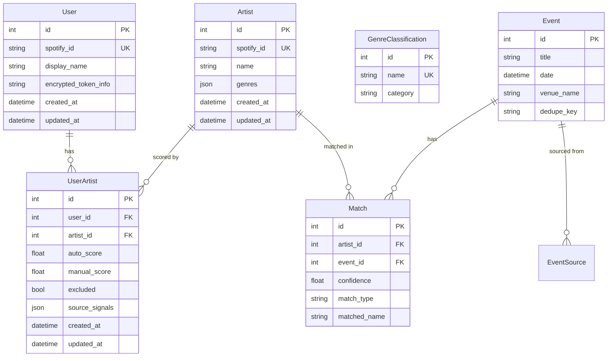

# Multi-User Spotify Auth & Per-User Scoring

## Overview

Transform the app from single-user to multi-user. Each user links their own Spotify account, imports their artists, and sees events scored against their personal affinities. Uses session-based auth so multiple users can work simultaneously in different browser tabs.

## Problem Statement / Motivation

Currently the app is hardcoded to one Spotify account via a global file cache (`data/.spotify_cache`). A second person on the same machine cannot link their own Spotify. All scoring, artist data, and event ranking is global — there's no concept of "whose taste is this?"

## Proposed Solution

- Add `User` and `UserArtist` tables
- Split the `Artist` table into a shared catalog (name, genres) + per-user scoring junction (`UserArtist`)
- Replace file-based token cache with encrypted per-user DB storage via spotipy's `CacheHandler` interface
- Add Starlette `SessionMiddleware` with cookie-based sessions
- Scope all artist/scoring/event views to the current session user

## Technical Approach

### Data Model Changes

**New tables:**
- `User` — id, spotify_id (unique), display_name, encrypted_token_info (Fernet-encrypted JSON blob of spotipy's token_info dict), timestamps
- `UserArtist` — user_id + artist_id (unique together), auto_score, manual_score, excluded, source_signals, timestamps. Has `effective_score` property (manual if set, else auto).

**Modified:**
- `Artist` — remove `auto_score`, `manual_score`, `excluded`, `source_signals`. Becomes a shared catalog.

**Unchanged:** Event, EventSource, Match, GenreClassification.

### Key Design Decisions

**Matching stays global, filtering at display time.** `run_matching()` matches all artists against all events (no exclusion filter at match time). Exclusion and scoring are applied per-user when rendering the events page. This avoids duplicate Match records per user. Note: this means slightly more Match records than before (previously excluded artists were skipped), but the volume is negligible.

**Genre classification stays shared.** One user reclassifying a genre affects everyone's scores. This is intentional — genre categories are objective.

**Tokens encrypted at rest.** Use `cryptography.fernet.Fernet` with a key from `FERNET_KEY` in `.env`. The spotipy `token_info` dict is serialized to JSON, encrypted, and stored as a single text column on `User`.

**Custom spotipy CacheHandler.** Implement `DatabaseCacheHandler(CacheHandler)` with two methods: `get_cached_token()` decrypts and returns the token dict from the User record; `save_token_to_cache()` encrypts and stores it. Spotipy handles token refresh automatically — it calls `save_token_to_cache` after every refresh.

**Session stores only user_id.** Starlette `SessionMiddleware` cookie holds `{"user_id": 123}`. Actual tokens live in the DB, not the cookie.

**`show_dialog=True` for account switching.** Without this, Spotify's browser session auto-authenticates as the previous account.

### Implementation Phases

#### Phase 1: Foundation — Session Middleware + User Model

**Files:** `app/main.py`, `app/models.py`, `.env`, `.env.example`, `requirements.txt`

1. Add `SESSION_SECRET` and `FERNET_KEY` to `.env` / `.env.example`
2. Add `cryptography` to `requirements.txt`
3. Create `User` model in `app/models.py` with fields: id, spotify_id (unique, indexed), display_name, encrypted_token_info, created_at, updated_at
4. Create `UserArtist` model with fields: user_id (FK), artist_id (FK), auto_score, manual_score (nullable), excluded (default False), source_signals (JSON), created_at, updated_at. Add unique constraint on (user_id, artist_id). Add `effective_score` property.
5. Add `SessionMiddleware` to FastAPI app in `app/main.py` with `secret_key` from env
6. Validate `SESSION_SECRET` and `FERNET_KEY` are set on startup (fail loudly if missing)
7. Add `get_current_user(request, db_session)` helper — reads `user_id` from `request.session`, loads User from DB, returns User or None. Used by all subsequent phases.

#### Phase 2: Auth Flow — Per-User OAuth + DB Token Storage

**Files:** `app/auth.py`, `app/routes/auth.py`

1. Implement `DatabaseCacheHandler(CacheHandler)` in `app/auth.py`:
   - `__init__(self, session, user_id, fernet_key)` — stores DB session, user_id, Fernet instance
   - `get_cached_token()` — loads User, decrypts `encrypted_token_info`, returns dict or None
   - `save_token_to_cache(token_info)` — encrypts token_info, saves to User record
2. Replace `get_spotify_oauth()` — now takes an optional `user_id` and `db_session` to create a CacheHandler. For the initial login (no user yet), use spotipy's `MemoryCacheHandler` — the token lives in memory only during the callback request.
3. Replace `is_authenticated(request)` — checks `request.session.get("user_id")` and verifies User exists in DB
4. Replace `get_spotify_client(request, session)` — loads user from session, creates SpotifyOAuth with DatabaseCacheHandler, returns client
5. Update `/login` route — use `show_dialog=True` when switching accounts (detect via query param or session state)
6. Update `/callback` route:
   - Exchange code for token
   - Fetch Spotify user profile (`sp.current_user()`) to get spotify_id and display_name
   - Find or create `User` by spotify_id
   - Encrypt and store token_info on User record (this is where the token moves from the temporary MemoryCacheHandler to the DB)
   - Set `request.session["user_id"] = user.id`
   - Redirect to `/artists`
7. Add `/logout` route — clears session, redirects to landing page
8. Remove dependency on `data/.spotify_cache` file

#### Phase 3: Data Migration

**Files:** `app/models.py`, new migration script or startup hook

The approach: try to migrate, but if it's painful, nuke and re-import.

1. On startup, detect if old schema exists (Artist table has `auto_score` column)
2. If old schema detected:
   a. Create new tables (`User`, `UserArtist`) via `create_all`
   b. Read existing `.spotify_cache` to identify the first user's spotify_id (if cache exists)
   c. Create a placeholder `User` record for the existing user (display_name = "Original User", no token — they'll re-auth)
   d. For each `Artist` with score data: create a `UserArtist` record copying auto_score, manual_score, excluded, source_signals
   e. Drop the old columns from Artist via `ALTER TABLE DROP COLUMN` (requires SQLite 3.35+; Python 3.12+ ships 3.41+, so this is safe)
3. If migration is too complex: log a warning, nuke the DB, let users re-import
4. Delete `data/.spotify_cache` if it exists

#### Phase 4: Spotify Import Pipeline — Per-User

**Files:** `app/spotify.py`, `app/routes/artists.py`

1. Refactor `import_all_artists(sp, session)` → `import_all_artists(sp, db_session, user_id)`:
   - Spotify fetch helpers (`_fetch_*`) stay unchanged — they just collect `artist_data` dicts
   - Artist upsert: create/update shared `Artist` records (name, spotify_id, genres only)
   - Score write: create/update `UserArtist` records for the given user_id with source_signals and auto_score
   - Genre backfill: skip artists that already have genres in the shared catalog
2. Refactor `backfill_lastfm(session)` → `backfill_lastfm(db_session, user_id)`:
   - Still writes genres to shared `Artist` records
   - Rescores only the given user's `UserArtist` records
3. Make `import_progress` per-user: change from a single dict to `dict[int, dict]` keyed by user_id
4. Update progress endpoints to read from `import_progress[user_id]`
5. Update `routes/artists.py`:
   - `run_import()` — get user from session, get user-specific Spotify client, pass user_id to background thread
   - `run_lastfm_backfill()` — same pattern

#### Phase 5: Scoring — Per-User

**Files:** `app/scoring.py`, `app/routes/genres.py`

1. `compute_auto_score()` — no change (already a pure function)
2. `compute_event_score()` — no change (already a pure function)
3. Refactor `rescore_all_artists(session)` → `rescore_user_artists(db_session, user_id)`:
   - Load `UserArtist` records for the given user
   - Join with `Artist` to get genres
   - Recompute auto_score on each UserArtist
4. Add `rescore_all_users(db_session)` — calls `rescore_user_artists` for every user. Used when genre classifications change (affects everyone).
5. Update `routes/genres.py`:
   - `classify_genre()` and `bulk_classify()` — call `rescore_all_users()` instead of `rescore_all_artists()`
   - `rescore_artists()` — same

#### Phase 6: Artist & Event Routes — Per-User Views

**Files:** `app/routes/artists.py`, `app/routes/events.py`

1. `list_artists()`:
   - Require authenticated user (redirect to login if not)
   - Load `UserArtist` records joined with `Artist` for the current user
   - Sort/filter using UserArtist.effective_score
   - Pass merged artist+score data to template
2. `show_artist()`:
   - Load `Artist` + `UserArtist` for current user
   - Display user-specific scores and signals
3. `list_events()`:
   - Require authenticated user
   - Load matches joined with Artist
   - For each matched artist, look up current user's `UserArtist` record
   - Only include matches where the user has a `UserArtist` record (hide others)
   - Apply user's `excluded` filter at display time
   - Compute event scores using user-specific effective_score
4. Make `event_progress` per-user (same pattern as `import_progress`)

#### Phase 7: UI Updates

**Files:** `app/templates/base.html`, `app/templates/artists.html`, `app/templates/events.html`, `app/templates/artist_detail.html`

1. `base.html` nav updates:
   - **Logged in**: show display name + "Switch Account" link (`/login?switch=1` with `show_dialog=True`) + "Log Out" link (`/logout`)
   - **Not logged in**: show "Link Spotify" button (`/login`)
2. All routes pass `current_user` to template context (via `get_current_user` from Phase 1)
3. `artists.html`:
   - Replace `artist.effective_score` → user_artist score from merged data
   - Replace `artist.source_signals` → same
   - Update auth check from `` to ``
4. `events.html`:
   - Score references already come from route context — just ensure the route passes user-specific scores
5. `artist_detail.html`:
   - Show user-specific scores and signals
6. Unauthenticated behavior: `/artists` already shows a "Connect Spotify" empty state — keep that. Add the same redirect-to-login pattern for `/events` and `/genres` (these pages are meaningless without a user context). No separate landing page needed.

## Acceptance Criteria

- [x] A user can click "Link Spotify" and authenticate with their Spotify account
- [x] After auth, importing artists creates per-user scoring data (UserArtist records)
- [x] A second user can click "Switch Account", authenticate with a different Spotify account, and see their own artist scores
- [x] Events are scored differently for each user based on their own artist affinities
- [x] Genre backfill skips artists already in the shared catalog
- [x] Genre reclassification rescores all users
- [x] Spotify tokens are encrypted at rest in the database
- [x] Two users in different browser tabs see their own data simultaneously
- [x] Existing single-user data is migrated to the first user's UserArtist records (best effort)
- [x] The nav shows who is logged in with switch/logout options
- [x] Matching remains global — exclusion and scoring applied at display time per-user

## System-Wide Impact

- **Interaction graph**: Login → creates/finds User → stores session cookie → every subsequent request reads session → loads User → scopes all queries. Genre reclassification → rescore all users (not just current).
- **Error propagation**: Token refresh failure → spotipy raises exception → import fails → user sees "re-authenticate" prompt. Session cookie invalid/expired → user redirected to login.
- **State lifecycle risks**: Background import thread holds a user_id — if the user logs out mid-import, the import completes but data is still valid. Global `import_progress` dict keyed by user_id — stale entries cleaned up on next import start.
- **Concurrency**: Two simultaneous imports are safe (different user_ids, different Spotify clients, different UserArtist records). `run_matching` deletes all Matches then recreates — this is an existing race condition that's acceptable for now (matching is fast).

## Dependencies & Risks

- **`cryptography` package** — new dependency for Fernet encryption. Well-maintained, widely used.
- **SQLite column dropping** — requires SQLite 3.35+ (Python 3.12+ ships 3.41+, so this is fine). Verify on startup.
- **Spotify `show_dialog`** — needed to prevent auto-re-auth when switching accounts. Without it, the second user silently gets the first user's Spotify session.
- **No CSRF protection** — HTMX adds `HX-Request` headers which provide partial protection, but not complete. Acceptable for now; flag for future hardening.

## References & Research

- **Brainstorm**: `docs/brainstorms/2026-03-30-multi-user-spotify-auth-brainstorm.md`
- **Spotipy CacheHandler**: `CacheHandler` base class in `spotipy.cache_handler` — requires `get_cached_token()` → dict|None and `save_token_to_cache(token_info)` → None. Passed to SpotifyOAuth via `cache_handler=` param.
- **Starlette SessionMiddleware**: Signs cookies with `itsdangerous.TimestampSigner`. Data is signed but not encrypted — store only user_id, not tokens.
- **Fernet encryption**: `cryptography.fernet.Fernet(key)` — symmetric encryption. Key must be 32 url-safe base64 bytes. Generate with `Fernet.generate_key()`.
