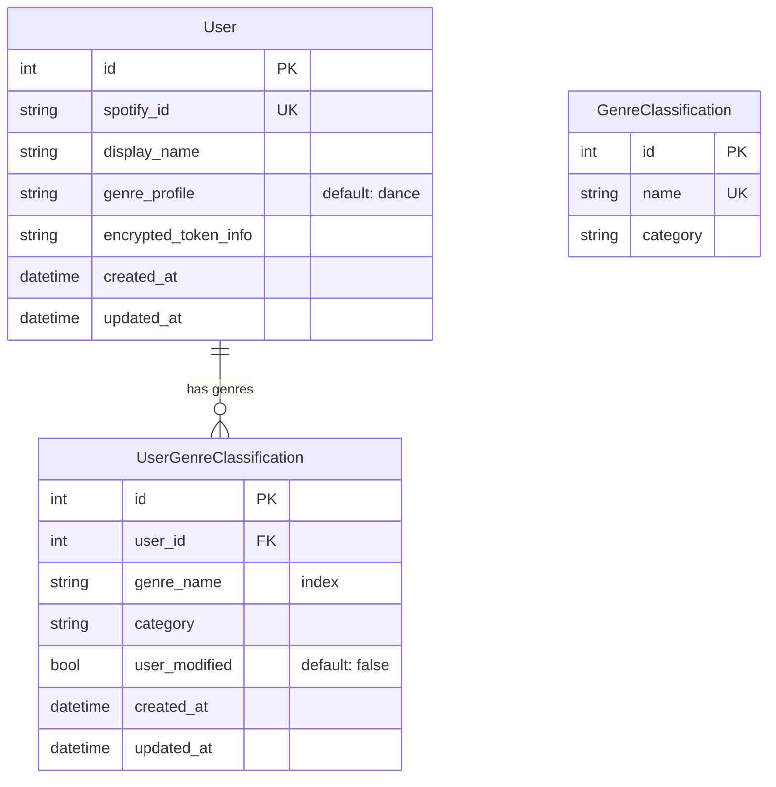

# feat: User-Level Genre Ranking

## Overview

Move genre classification from a single global table to per-user preferences. Each user gets their own genre→category mappings, scoped to genres that appear on their artists. The global `GenreClassification` table becomes the "dance" profile template — admin-writable, used to seed new users and propagate classifications to users who haven't overridden them.

## Problem Statement / Motivation

Currently all users share one `GenreClassification` table. When someone classifies "jazz" as "other" (0.1x), it crushes scoring for every user who listens to jazz. The app only works well for dance music fans. Per-user genre ranking is the foundation that makes the app useful for any music taste.

## Category System

Replace dance-centric labels with generic, profile-agnostic categories:

| Category | Multiplier | Old label | Meaning |
|---|---|---|---|
| `high` | 1.0 | `dance` | Core genre the user actively seeks out |
| `medium` | 0.5 | `adjacent` | Related genre the user enjoys |
| `low` | 0.1 | `other` | Not really their thing |
| `unclassified` | 0.3 | `unclassified` | Not yet classified (temporary state) |

These work across all profile types — a jazz profile has jazz genres as "high", a dance profile has techno as "high".

**Migration of existing data:** All `GenreClassification` rows get remapped: `dance→high`, `adjacent→medium`, `other→low`, `unclassified→unclassified`.

**UI buttons:** Change from D/A/O to H/M/L (or icons/colors representing the tiers).

**Code constants:**

```python
CATEGORY_MULTIPLIERS = {
    "high": 1.0,
    "medium": 0.5,
    "low": 0.1,
    "unclassified": 0.3,
}
```

## Proposed Solution

### Data Model Changes



**New table: `UserGenreClassification`**
- `id` (PK), `user_id` (FK, indexed), `genre_name` (str, indexed), `category` (str), `user_modified` (bool, default False)
- `created_at`, `updated_at` (standard timestamps)
- `UniqueConstraint(user_id, genre_name)`
- `user_modified` tracks whether the user has manually changed this row — admin propagation only touches rows where `user_modified = False`

**Modified table: `User`**
- Add `genre_profile: str = "dance"` — which profile template they started from

**Existing table: `GenreClassification`** (unchanged schema)
- Repurposed as the "dance" profile template
- Admin-writable: admins classify genres here, changes propagate to users who haven't overridden

### Endpoint Changes

Switch classify routes from `genre_id` to `genre_name` to avoid cross-table ID confusion:

| Endpoint | Current | New |
|---|---|---|
| `GET /genres` | Global genre list | User-scoped genre list (from `UserGenreClassification`) |
| `GET /genre/{genre_name}` | Global artists | User's artists only (inner join `UserArtist`) |
| `POST /genres/{genre_name}/classify` | Writes to `GenreClassification`, rescores all | Writes to `UserGenreClassification`, rescores user only |
| `POST /genres/bulk-classify` | Global bulk classify | User-scoped bulk classify |
| `POST /genres/reset` | N/A (new) | Reset user's genres to profile defaults |
| `POST /admin/genres/{genre_name}/classify` | N/A (new) | Writes to global template, propagates to `user_modified = False` rows, rescores affected users |

**Admin identity:** Add `ADMIN_SPOTIFY_IDS` to `Settings` (comma-separated env var). Check against `user.spotify_id` in admin routes. No DB schema change needed.

### Core Function: `seed_user_genres()`

A single reusable function in `app/scoring.py`:

```python
def seed_user_genres(session: Session, user_id: int, replace: bool = False) -> None:
    """Copy genres for a user's artists from their profile template.

    replace=False (default): insert only genres the user doesn't have yet.
    replace=True: delete all user's genre rows and re-seed from template.
      Genres not in the template get set to unclassified.
    """
```

Called from:
- **Migration** — `seed_user_genres(session, user_id)` for each existing user
- **First import** — after `_sync_genre_classifications()`, call `seed_user_genres(session, user_id)`
- **Subsequent imports** — same call, `replace=False` only inserts new genres
- **Reset to defaults** — `seed_user_genres(session, user_id, replace=True)`

### Import Flow Changes

In `app/spotify.py`:
1. Skip `_backfill_genres` and `_sync_artist_genres` for artists that already have `ArtistGenre` rows — only fetch genres for artists new to the system
2. After `_sync_genre_classifications()` (which adds new genres to global table), call `seed_user_genres(session, user_id)` to add them to the importing user's table
3. The existing preservation logic at lines 102-111 already keeps DB genres for known artists

### Scoring Changes

In `app/scoring.py`:
- `get_genre_map(session, user_id)` reads from `UserGenreClassification` instead of `GenreClassification`
- `rescore_user_artists(session, user_id)` already receives `user_id` — just pass it through to `get_genre_map`
- Remove `rescore_all_users()` — replace with targeted rescoring of affected users in admin classify

## Technical Considerations

### Architecture

- **No new dependencies** — pure data model + query changes
- **Migration pattern** — follows existing `app/migration.py` detection-based idempotency: check if `UserGenreClassification` table has rows, if not, seed all users
- **HTMX** — existing partial swap patterns work unchanged, just different data source

### Performance

- `UserGenreClassification` queries are fast — indexed on `user_id`, typically 300-800 rows per user
- Admin propagation: single `UPDATE ... WHERE genre_name = ? AND user_modified = false` — needs `genre_name` index (included in model)
- Admin rescore: only affected users (those whose rows were updated), not all users

### Edge Cases

- **New user, no artists yet**: `/genres` shows empty state with prompt to import
- **Genre not in template during reset**: set to unclassified (not deleted) so scoring still works
- **Race condition (concurrent import + classify)**: use `INSERT OR IGNORE` / check-then-insert with unique constraint. SQLite serializes writes, so this is safe at current scale
- **Auto-populate block** in `GET /genres` (lines 28-35 of `genres.py`): remove entirely — seeding now happens via `seed_user_genres()` during import

## System-Wide Impact

- **`get_genre_map()` call sites** — 5 locations need `user_id` parameter added:
  - `scoring.py:89` (in `rescore_user_artists` — already has `user_id`)
  - `spotify.py:155` (in `_upsert_user_artists` — already has `user_id`)
  - `spotify.py:404` (in `backfill_lastfm` — already has `user_id`)
  - `genres.py:122` (in `genre_detail` — has `user` from auth)
  - `artists.py:167` and `artists.py:283` (in artist routes — has `user` from auth)
- **Template changes required** (all have hardcoded dance/adjacent/other references):
  - `genre_row.html` — D/A/O buttons → H/M/L, category values dance→high etc., CSS classes `active`/`active-adj`/`active-other` → new names, route from `genre.id` → `genre.name`
  - `genre_detail.html` — same D/A/O popup changes, route from `genre.id` → `genre.name`
  - `genres.html` — category filter dropdown options "Dance"/"Adjacent"/"Other" → "High"/"Medium"/"Low", data source switches from `GenreClassification` to `UserGenreClassification`
  - `_genre_tags.html` — CSS classes `dance`/`adjacent`/`other` → `high`/`medium`/`low`
  - `_signal_breakdown.html` — `genre_map` now returns new category names; multiplier display is data-driven via `category_multipliers` dict so mostly works, but the `unclassified` skip logic (line 32) should be reviewed
  - `base.html` — CSS color definitions `.genre-tag.dance`/`.adjacent`/`.other` → `.high`/`.medium`/`.low`
- **New UI elements:**
  - "Reset to defaults" button on `/genres` page
  - Empty state prompt on `/genres` when user has no genres yet (link to import)
- **Front-end spec** — `docs/front-end-spec.md` must be updated per project conventions

## Acceptance Criteria

### Phase 1 (this work)

- [x] `UserGenreClassification` table created with correct schema
- [x] `genre_profile` column added to `User` (default "dance")
- [x] Existing users migrated: their artists' genres seeded from global `GenreClassification`
- [x] `/genres` page shows user's own genre classifications, artist counts scoped to their library
- [x] Existing `GenreClassification` categories migrated: dance→high, adjacent→medium, other→low
- [x] `CATEGORY_MULTIPLIERS` updated to use new labels (high/medium/low/unclassified)
- [x] Classify buttons (H/M/L) write to `UserGenreClassification`, rescore only that user
- [x] Auth added to classify endpoints (currently missing)
- [x] `seed_user_genres()` function works for migration, import sync, and reset
- [x] "Reset to defaults" button on `/genres` page
- [x] Import only fetches genres for artists new to the system
- [x] Import syncs new genres into importing user's `UserGenreClassification`
- [x] `get_genre_map(session, user_id)` reads from user's table
- [x] Admin classify route writes to global template, propagates to `user_modified = False` rows
- [x] `ADMIN_SPOTIFY_IDS` config setting for admin identity
- [x] Genre detail page shows only user's artists
- [x] Auto-populate block removed from `/genres` GET handler
- [x] `docs/front-end-spec.md` updated

### Testing

- [ ] User A classifies "jazz" as "high" — User B's "jazz" is unaffected
- [ ] Admin classifies unclassified genre — propagates to users who haven't overridden
- [ ] Admin classify does NOT overwrite user's manual classification
- [ ] Import discovers new genre → added to importing user's table with template category
- [ ] Reset restores all genres to profile defaults, genres not in template become unclassified
- [ ] New user with no artists sees empty genres page with import prompt

## Implementation Phases

### Phase 1a: Data model + migration
1. Add `UserGenreClassification` model to `app/models.py`
2. Add `genre_profile` to `User` model
3. Add `ADMIN_SPOTIFY_IDS` to `app/config.py`
4. Update `CATEGORY_MULTIPLIERS` in `app/scoring.py` to new labels (high/medium/low/none/unclassified)
5. Write migration in `app/migration.py`:
   - Migrate existing `GenreClassification.category` values: dance→high, adjacent→medium, other→low
   - Create `UserGenreClassification` table
   - Add `genre_profile` column to `User`
   - Seed existing users via `seed_user_genres()`
6. Write `seed_user_genres()` in `app/scoring.py`

### Phase 1b: Scoring + import changes
6. Update `get_genre_map(session, user_id)` to read from `UserGenreClassification`
7. Thread `user_id` through all `get_genre_map` call sites
8. Update import to skip genre fetch for existing artists
9. Update import to call `seed_user_genres()` after genre sync

### Phase 1c: Route + template changes
10. Update `/genres` GET to query `UserGenreClassification` with user-scoped artist counts
11. Switch classify endpoint from `genre_id` to `genre_name`, write to user table
12. Add auth to classify and bulk-classify endpoints
13. Add `POST /genres/reset` endpoint
14. Add `POST /admin/genres/{genre_name}/classify` endpoint
15. Update `base.html` CSS: rename `.genre-tag.dance`/`.adjacent`/`.other` → `.high`/`.medium`/`.low`
16. Update `genre_row.html`: D/A/O → H/M/L buttons, new category values, route from `genre.id` → `genre.name`
17. Update `genre_detail.html`: same classify popup changes, route from `genre.id` → `genre.name`
18. Update `genres.html`: category filter dropdown options → High/Medium/Low, add "Reset to defaults" button, add empty state prompt
19. Update `_genre_tags.html`: CSS classes `dance`/`adjacent`/`other` → `high`/`medium`/`low`
20. Update `_signal_breakdown.html`: review unclassified skip logic with new category names
21. Remove auto-populate block from `/genres` GET
22. Update `docs/front-end-spec.md`

## Dependencies & Risks

- **No external dependencies** — all changes are internal
- **Migration risk is low** — additive (new table + new column), no destructive schema changes
- **Biggest risk**: missing a `get_genre_map` call site, causing scoring to use wrong genre map. Mitigated by searching for all callers and updating systematically in Phase 1b.

## References

- Brainstorm: `docs/brainstorms/2026-03-31-user-level-genre-ranking-brainstorm.md`
- Current genre routes: `app/routes/genres.py`
- Current scoring: `app/scoring.py`
- Current models: `app/models.py`
- Current import: `app/spotify.py`
- Migration patterns: `app/migration.py`
- Multi-user auth plan (reference pattern): `docs/plans/2026-03-30-feat-multi-user-spotify-auth-plan.md`
