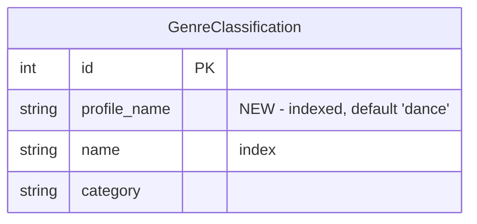

# feat: Genre Profile Templates

## Overview

Add multiple genre starter templates (dance, jazz, rock, pop, country, "no preference") so new users can choose which one seeds their `UserGenreClassification` table. The template is a one-time seed — after that, the user owns their classifications completely.

## Problem Statement / Motivation

The app currently hardcodes every user to the "dance" template. A jazz fan signs up and all their favourite genres get crushed by low multipliers. Phase 1 built the per-user infrastructure; Phase 2 makes it useful for non-dance listeners by offering genre-appropriate starters.

## Proposed Solution

### New signup flow

```
Login → OAuth → [new user?] → /imports → import artists → /choose-profile → seed genres → /artists
                [returning?] → /artists (unchanged)
```

New users (detected by zero `UserArtist` rows) get redirected to `/imports` first, then after import completes to `/choose-profile` where they pick a starter template. `seed_user_genres()` runs synchronously in the POST handler with the chosen `profile_name` — no need to persist the choice.

### Data model changes



**`GenreClassification` (modified)**
- Add `profile_name: str` column (indexed, default `"dance"`)
- Change unique constraint from `name` to `UniqueConstraint(profile_name, name)`
- Existing rows get `profile_name='dance'`

**`User` (modified)**
- Drop `genre_profile` column — the template choice is transient, not persisted

**`UserGenreClassification`** — no changes

### Simplifications

- **Drop admin propagation** — admin edits to templates only affect future signups. Remove the propagation logic in `admin_classify_genre` (genres.py:309-327). The `user_modified` column on `UserGenreClassification` becomes unused but can be left in place to avoid a destructive migration.
- **"Reset to defaults" → "Clear all classifications"** — sets all user's genres to `unclassified` instead of re-seeding from a template.
- **Re-imports seed new genres as unclassified** — the template is a one-time starter for the initial import only.

## Technical Approach

### Phase 1: Data model + migration

**`app/models.py`**

1. Add `profile_name` to `GenreClassification`:
   ```python
   class GenreClassification(SQLModel, table=True):
       __table_args__ = (
           UniqueConstraint("profile_name", "name", name="uq_profile_genre"),
       )
       id: Optional[int] = Field(default=None, primary_key=True)
       profile_name: str = Field(default="dance", index=True)
       name: str = Field(index=True)  # remove unique=True
       category: str = Field(default="unclassified")
   ```

2. Remove `genre_profile` from `User` model (line 16)

**`app/migration.py`**

3. New migration function `_add_profile_name_to_genre_classification()`:
   - Check if `profile_name` column exists on `genreclassification`
   - If not: `ALTER TABLE genreclassification ADD COLUMN profile_name VARCHAR DEFAULT 'dance'`
   - SQLite limitation: can't modify unique constraints in-place. The old `unique=True` on `name` was set at table creation. For existing DBs, the new `UniqueConstraint(profile_name, name)` will be enforced by SQLModel on new inserts. The old single-column unique index should be dropped if possible, or left (it won't conflict since all existing rows share `profile_name='dance'`).

4. New migration function `_drop_genre_profile_from_user()`:
   - Attempt `ALTER TABLE user DROP COLUMN genre_profile` (may fail silently on older SQLite, which is fine — the column just goes unused)

5. New migration function `_seed_initial_profile_templates()`:
   - Check if any `GenreClassification` rows exist with `profile_name != 'dance'`
   - If not, insert initial seed data for jazz, rock, pop, country profiles (~20-30 genres each)

6. Add calls to these functions in `run_migration()`

### Phase 2: `seed_user_genres()` changes

**`app/scoring.py`** (lines 106-178)

7. Add `profile_name: str = "dance"` parameter to `seed_user_genres()`:
   ```python
   def seed_user_genres(session: Session, user_id: int, replace: bool = False, profile_name: str = "dance") -> None:
   ```

8. Change the template loading (line 130-133) to filter by `profile_name`:
   ```python
   if profile_name == "none":
       template = {}  # everything defaults to unclassified
   else:
       template = {
           gc.name: gc.category
           for gc in session.exec(
               select(GenreClassification).where(
                   GenreClassification.profile_name == profile_name
               )
           ).all()
       }
   ```

9. Update `replace=True` path to set all genres to `unclassified` instead of re-seeding from template (for the "Clear all" use case):
   ```python
   if replace:
       existing = session.exec(
           select(UserGenreClassification).where(
               UserGenreClassification.user_id == user_id
           )
       ).all()
       for row in existing:
           row.category = "unclassified"
           row.user_modified = False
           session.add(row)
       session.flush()
   ```

   Actually — the reset route should just do a direct UPDATE, not call `seed_user_genres`. See Phase 4 below.

### Phase 3: Auth flow + profile selection page

**`app/routes/auth.py`** (line 95)

10. Change the callback redirect for new users:
    ```python
    if not user:
        user = User(spotify_id=spotify_id, display_name=display_name)
        session.add(user)
        session.commit()
        session.refresh(user)
        is_new = True
    else:
        user.display_name = display_name
        session.add(user)
        is_new = False
    ```
    At line 95:
    ```python
    if is_new:
        return RedirectResponse("/artists")  # new users go to /artists which detects no artists and shows import
    return RedirectResponse("/artists")
    ```

    Wait — per the brainstorm, new users (no `UserArtist` rows) get redirected to `/imports`. This detection happens at the `/artists` GET handler, not in the callback. The callback can just always redirect to `/artists` as it does now.

11. **Import completion redirect changes.** Currently the import flow auto-redirects to `/artists` in two places:
    - `import_progress_bar.html` line 2: `<script>window.location.href = "/artists";</script>` (HTMX polling detects `progress.done`)
    - `import_progress` route in `artists.py` line 70-71: server-side redirect when `progress["done"]`

    Both need to redirect to `/choose-profile` instead of `/artists` for first-time users (users with no `UserGenreClassification` rows). The simplest approach: pass a `redirect_url` to the template context from the progress routes, computed based on whether the user has genre classifications yet.

    **`app/routes/artists.py`** — update `show_progress` and `progress_bar`:
    ```python
    # Determine where to go after import
    has_genres = session.exec(
        select(UserGenreClassification.id).where(
            UserGenreClassification.user_id == user.id
        ).limit(1)
    ).first()
    redirect_url = "/artists" if has_genres else "/choose-profile"
    ```
    Pass `redirect_url` in the template context.

    **`app/templates/import_progress_bar.html`** — change line 2:
    ```html
    <script>window.location.href = "{{ redirect_url }}";</script>
    ```

    **`app/routes/artists.py`** — update `show_progress` redirect (line 70-71):
    ```python
    if progress["done"] and not progress["running"]:
        return RedirectResponse(redirect_url, status_code=303)
    ```

    This ensures the import page is not an auto-skip — it completes, then deliberately sends the user to `/choose-profile` where they make their template selection before continuing to `/artists`.

12. **Hide navigation on onboarding pages.** The import progress and profile selection pages should not show the nav header (Artists/Events/Genres/Admin links) since the user hasn't completed setup. Currently the nav is hardcoded in `base.html` with no way to suppress it.

    **`app/templates/base.html`** — wrap the nav in a block so child templates can override it:
    ```html
    
    <nav>
        <a href="/artists">Artists</a>
        ...
    </nav>
    
    ```

    **`app/templates/import_progress.html`** and **`app/templates/choose_profile.html`** — suppress nav:
    ```html
    
    ```

**New route: `/choose-profile`**

13. Add to `app/routes/auth.py` (or a new `app/routes/profile.py`):

    ```python
    @router.get("/choose-profile", response_class=HTMLResponse)
    def choose_profile_page(request: Request, session: Session = Depends(get_session)):
        user = get_current_user(request, session)
        if not user:
            return RedirectResponse("/login", status_code=303)
        # If user already has genre classifications, skip
        has_genres = session.exec(
            select(UserGenreClassification.id).where(
                UserGenreClassification.user_id == user.id
            ).limit(1)
        ).first()
        if has_genres:
            return RedirectResponse("/artists", status_code=303)
        return templates.TemplateResponse(request, "choose_profile.html", {})

    @router.post("/choose-profile")
    def choose_profile_submit(
        request: Request,
        profile_name: str = Form(),
        session: Session = Depends(get_session),
    ):
        user = get_current_user(request, session)
        if not user:
            return RedirectResponse("/login", status_code=303)
        valid_profiles = ("dance", "jazz", "rock", "pop", "country", "none")
        if profile_name not in valid_profiles:
            profile_name = "none"
        seed_user_genres(session, user.id, profile_name=profile_name)
        rescore_user_artists(session, user.id)
        return RedirectResponse("/artists", status_code=303)
    ```

**New template: `app/templates/choose_profile.html`**

14. Simple page following the `request_access.html` pattern:
    ```html
    
    
    <div class="empty-state">
        <h2>What music are you into?</h2>
        <p style="margin-top: 12px; max-width: 480px; margin-left: auto; margin-right: auto;">
            Pick a starting point — this just sets initial genre priorities.
            You can change any genre's rating later on the Genres page.
        </p>
        <form method="post" action="/choose-profile" style="margin-top: 24px; text-align: left; max-width: 320px; margin-left: auto; margin-right: auto;">
            <label style="display: block; padding: 8px 0; cursor: pointer;">
                <input type="radio" name="profile_name" value="dance" checked> Dance &amp; Electronic
            </label>
            <label style="display: block; padding: 8px 0; cursor: pointer;">
                <input type="radio" name="profile_name" value="jazz"> Jazz
            </label>
            <label style="display: block; padding: 8px 0; cursor: pointer;">
                <input type="radio" name="profile_name" value="rock"> Rock
            </label>
            <label style="display: block; padding: 8px 0; cursor: pointer;">
                <input type="radio" name="profile_name" value="pop"> Pop
            </label>
            <label style="display: block; padding: 8px 0; cursor: pointer;">
                <input type="radio" name="profile_name" value="country"> Country
            </label>
            <label style="display: block; padding: 8px 0; cursor: pointer;">
                <input type="radio" name="profile_name" value="none"> No preference — I'll classify genres myself
            </label>
            <button type="submit" class="btn" style="margin-top: 16px; width: 100%;">Continue</button>
        </form>
    </div>
    
    ```

### Phase 4: Reset + admin changes

**`app/routes/genres.py`**

15. Update the reset route (line 271-283):
    - Rename from "Reset to defaults" to "Clear all classifications"
    - Instead of calling `seed_user_genres(replace=True)`, do a direct UPDATE:
      ```python
      @router.post("/genres/reset")
      def clear_classifications(request: Request, session: Session = Depends(get_session)):
          user = get_current_user(request, session)
          if not user:
              return RedirectResponse("/login", status_code=303)
          session.exec(
              text("UPDATE usergenreclassification SET category = 'unclassified', user_modified = 0 WHERE user_id = :uid"),
              params={"uid": user.id},
          )
          session.commit()
          rescore_user_artists(session, user.id)
          return RedirectResponse("/genres", status_code=303)
      ```

16. Update `admin_classify_genre` (line 286-328):
    - Remove propagation logic (lines 309-327)
    - Add `profile_name` parameter so admin can specify which template they're editing
    - Update the query to filter by `profile_name`:
      ```python
      gc = session.exec(
          select(GenreClassification).where(
              GenreClassification.name == genre_name,
              GenreClassification.profile_name == profile_name,
          )
      ).first()
      ```

17. Update `_sync_genre_classifications` in `app/spotify.py` (line 199-215):
    - Currently adds new genres with no `profile_name` (will default to "dance")
    - This only needs to add genres to the dance template (or could add to all templates). Simplest: add to dance only. Admin can manually add to other templates.

### Phase 5: Import flow changes

**`app/spotify.py`**

18. The `seed_user_genres` calls at lines 134 and 407 currently pass no `profile_name`. After Phase 2:
    - Line 134 (end of `import_all_artists`): **Remove this call entirely.** Seeding now happens in the `/choose-profile` POST handler, after import completes. The import just loads artists and genres; the template application happens separately.
    - Line 407 (end of `backfill_lastfm`): Change to seed new genres as unclassified: `seed_user_genres(session, user_id, profile_name="none")`

19. For re-imports (user already has `UserGenreClassification` rows): `seed_user_genres` with `replace=False` and `profile_name="none"` will add new genres as unclassified. This is the desired behavior.

    But wait — if we remove the `seed_user_genres` call from `import_all_artists` (step 18), then re-imports won't seed new genres at all. We need to keep the call but use `profile_name="none"`:
    ```python
    # Line 134: seed new genres as unclassified (template only used at /choose-profile)
    seed_user_genres(session, user_id, profile_name="none")
    ```

### Phase 6: Template updates + front-end spec

20. Update `app/templates/genres.html`: rename "Reset to defaults" button to "Clear all classifications"

21. Update `docs/front-end-spec.md`:
    - Add `/choose-profile` page section
    - Update Genres section: "Reset to defaults" → "Clear all classifications"
    - Update signup flow description

### Phase 7: Seed data for templates

22. Create initial genre classifications for each profile. This is the most subjective part. ~20-30 genres per profile, classified as high/medium/low. Everything else stays unclassified.

    This should be a migration function that inserts rows into `GenreClassification` with the appropriate `profile_name`. Example seed data:

    **Jazz profile** — high: jazz, bebop, hard bop, cool jazz, soul jazz, free jazz, jazz fusion, smooth jazz, vocal jazz, latin jazz, acid jazz; medium: soul, r&b, funk, neo-soul, blues; low: (none explicitly — everything else is unclassified)

    **Rock profile** — high: rock, classic rock, alternative rock, indie rock, punk rock, hard rock, progressive rock, psychedelic rock, garage rock, post-punk, grunge, shoegaze; medium: metal, indie, folk rock, blues rock; low: (none)

    **Pop profile** — high: pop, indie pop, synth-pop, electropop, art pop, dream pop, k-pop, dance pop, teen pop; medium: r&b, singer-songwriter, folk pop; low: (none)

    **Country profile** — high: country, country rock, outlaw country, alt-country, bluegrass, country pop, americana, country blues; medium: folk, singer-songwriter, southern rock; low: (none)

    These are starting points — admin refines over time.

## System-Wide Impact

- **`seed_user_genres()` call sites** — 3 locations need the new `profile_name` parameter:
  - `spotify.py:134` — change to `profile_name="none"` (re-import seeds unclassified)
  - `spotify.py:407` — change to `profile_name="none"` (lastfm backfill)
  - `genres.py:280` — replace with direct UPDATE (clear all)
  - `migration.py:233` — existing users already seeded, no change needed (migration won't re-run)

- **`_sync_genre_classifications()` in `spotify.py:199`** — currently adds genres without `profile_name`. Needs to add with `profile_name="dance"` (or handle the new column default).

- **`admin_classify_genre()` in `genres.py:286`** — query changes to include `profile_name`. Propagation logic removed.

- **`GenreClassification` queries** — any code querying this table needs to account for the new `profile_name` column. Check `get_genre_map()` fallback path in `scoring.py:51`.

## Acceptance Criteria

- [ ] `GenreClassification` has `profile_name` column, existing rows have `profile_name='dance'`
- [ ] `User.genre_profile` column dropped (or unused)
- [ ] New users see `/choose-profile` after their first import completes
- [ ] `/choose-profile` shows radio list: dance, jazz, rock, pop, country, no preference
- [ ] Choosing a profile seeds `UserGenreClassification` from the correct template
- [ ] "No preference" seeds all genres as unclassified
- [ ] Returning users (have `UserGenreClassification` rows) skip `/choose-profile`
- [ ] Users who abandon before choosing a profile default to unclassified on next visit
- [ ] "Clear all classifications" button on `/genres` sets all genres to unclassified
- [ ] Admin classify edits a specific profile template, no propagation to existing users
- [ ] Re-imports seed new genres as unclassified regardless of original template
- [ ] Initial seed data exists for jazz, rock, pop, country profiles (~20-30 genres each)
- [ ] `docs/front-end-spec.md` updated

## Dependencies & Risks

- **SQLite constraint limitation** — can't alter unique constraints on existing tables. The old `unique=True` on `GenreClassification.name` may conflict when inserting the same genre name for different profiles. May need to recreate the table (SQLite table rebuild pattern) or drop and recreate the index.
- **Seed data quality** — the initial genre classifications for non-dance profiles are subjective. Starting minimal (20-30 per profile) and growing via admin reduces risk.
- **No rollback for `User.genre_profile` drop** — once dropped, can't recover. Low risk since the column is currently unused at runtime.

## References

- Brainstorm: `docs/brainstorms/2026-04-19-genre-profile-templates-brainstorm.md`
- Phase 1 plan: `docs/plans/2026-03-31-feat-user-level-genre-ranking-plan.md`
- Current models: `app/models.py`
- Current scoring/seeding: `app/scoring.py:106-178`
- Current auth flow: `app/routes/auth.py:45-95`
- Current import flow: `app/routes/artists.py:27-62`
- Current admin classify: `app/routes/genres.py:286-328`
- Current reset route: `app/routes/genres.py:271-283`
- Migration patterns: `app/migration.py`
- UI pattern reference: `app/templates/request_access.html`
