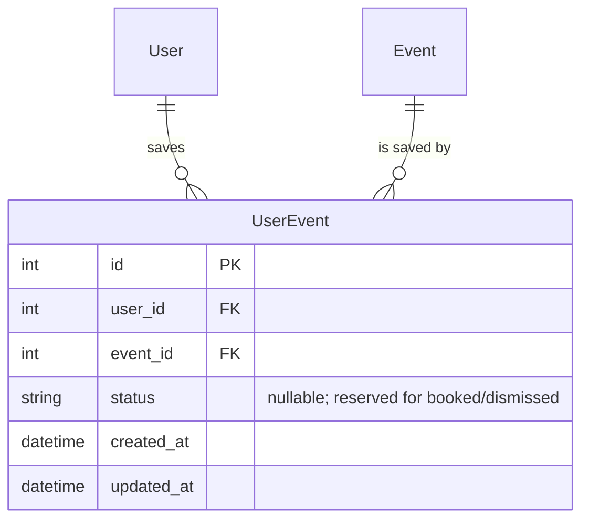

# feat: Add per-user saved events

## Overview

Adds a private "save this event" bookmark for logged-in users so they can shortlist gigs without booking immediately, copying details elsewhere, or refinding them on every visit. New `UserEvent` join table; save action lives on `/event/{id}` only (preserves cramped horizontal space on `/events`); list views show saved state via a left-edge accent stripe; the existing `My artists | All events` segmented toggle becomes a `<select>` dropdown with a third `Saved` option. Saved view auto-hides past events. Strictly private.

## Problem Statement

Today every visit to `/events` is a clean slate. If you spot a promising gig you have three bad options: book immediately, copy the link somewhere else, or re-find it next session by repeating the discovery filters. The tool's matching is what makes events surface in the first place — without persistence, every match cycle starts from zero.

## Proposed Solution

A single-state bookmark following the same per-user-join-table pattern as `UserArtist` and `UserGenreClassification`. The table ships with a nullable `status` column reserved for future `booked` / `dismissed` extensions but the v1 contract is just "row exists → saved." The save action is intentionally only available on the event detail page; the list shows status passively via a left-edge stripe. The filter dropdown unifies the existing two-way toggle with the new saved view.

## Schema

### ERD



### Model (`app/models.py`)

Append after `UserGenreClassification`:

```python
class UserEvent(SQLModel, table=True):
    __table_args__ = (
        UniqueConstraint("user_id", "event_id", name="uq_user_event"),
    )

    id: Optional[int] = Field(default=None, primary_key=True)
    user_id: int = Field(foreign_key="user.id", index=True)
    event_id: int = Field(foreign_key="event.id", index=True)
    status: Optional[str] = Field(default=None)
    created_at: datetime = Field(default_factory=_utcnow)
    updated_at: datetime = Field(
        default_factory=_utcnow,
        sa_column_kwargs={"onupdate": _utcnow},
    )
```

**Status semantics (v1):** row presence = saved; `status` is always `NULL`. Documented for future readers so when `booked` / `dismissed` are added, a `NULL` value still means "saved (legacy default)."

### Migration

**No `app/migration.py` helper needed.** `init_db()` in `app/database.py:8-9` calls `SQLModel.metadata.create_all(engine)` on startup, which creates any missing tables from registered models. Adding `UserEvent` to `models.py` is the entire migration.

> If we later add a non-nullable column or alter a constraint, follow the existing detect-and-fix idiom in `app/migration.py` (SELECT-probe in try/except, then `ALTER TABLE`).

## Routes

### Toggle endpoints (`app/routes/events.py`)

Two explicit, idempotent endpoints following the `app/routes/genres.py:179` classify pattern:

```python
@router.post("/event/{event_id}/save")
def save_event(event_id: int, request: Request, session: Session = Depends(get_session)):
    user = get_current_user(request, session)
    if not user:
        return _login_redirect(request)  # HX-Redirect header if HTMX
    event = session.get(Event, event_id)
    if not event:
        return RedirectResponse("/events", status_code=303)
    existing = session.exec(
        select(UserEvent).where(
            UserEvent.user_id == user.id,
            UserEvent.event_id == event_id,
        )
    ).first()
    if not existing:
        session.add(UserEvent(user_id=user.id, event_id=event_id))
        session.commit()
    return _render_save_button(request, event, is_saved=True)

@router.post("/event/{event_id}/unsave")
def unsave_event(...):
    # mirror image — deletes the row if present
```

**Idempotent:** double-POST of `/save` does nothing on the second call; same for `/unsave`. This avoids the "toggle endpoint flips back on double-click" footgun.

### `_login_redirect` helper

```python
def _login_redirect(request: Request):
    if request.headers.get("HX-Request"):
        resp = Response(status_code=204)
        resp.headers["HX-Redirect"] = "/login"
        return resp
    return RedirectResponse("/login", status_code=303)
```

Reason: HTMX won't follow a bare 303 into the page DOM; `HX-Redirect` is the documented way to bounce mid-session-expired requests. Reusable across future HTMX routes.

### List route changes (`list_events` in `app/routes/events.py`)

1. Add `view: str = "mine"` query param (replaces `show_all: str = ""`).
2. Back-compat: at the top of the handler, if `show_all` (or a legacy `?show_all=1` URL) arrives, alias to `view="all"`.
3. Branch the matched-only filter on `view`:
   - `view="mine"` (default): existing behaviour — events with `event_scores.get(e.id, 0) > 0`.
   - `view="all"`: existing `show_all` behaviour — all events in the city/date range.
   - `view="saved"`: events whose id is in the user's saved-event set; **no score gating** (allow user to save unmatched events too).
4. Load `saved_event_ids: set[int]` once per request and pass into template (used for both the row-stripe and the filter logic).
5. **Default sort override:** when `view="saved"` and no explicit `sort` was passed, default to `sort="date"` (ascending) instead of `sort="score"`. Many saved events will be score-0; date-ordered shortlist is more useful.
6. Past-event hiding for `view="saved"`: rely on existing `date_from = today` default — saved view inherits the same default and so past events are hidden automatically. Same code path, no special case.

### Event detail route (`show_event` in `app/routes/events.py`)

Add `is_saved: bool` to the template context:

```python
is_saved = session.exec(
    select(UserEvent).where(
        UserEvent.user_id == user.id,
        UserEvent.event_id == event_id,
    )
).first() is not None
```

Pass through to template.

### Artist detail route (`show_artist` in `app/routes/artists.py`)

Add `saved_event_ids: set[int]` to the context, scoped to the events the page already loads:

```python
event_ids = [e.id for e in events]
saved_event_ids = set(session.exec(
    select(UserEvent.event_id).where(
        UserEvent.user_id == user.id,
        UserEvent.event_id.in_(event_ids),
    )
).all())
```

## Templates & CSS

### New: save button partial (`app/templates/_save_button.html`)

Tiny partial used both by initial event-detail render and HTMX swap responses. Single template, branches on `is_saved`.

```html
{# context: event, is_saved #}
<form id="save-btn"
      hx-post="{{ '/event/' ~ event.id ~ ('/unsave' if is_saved else '/save') }}"
      hx-target="#save-btn"
      hx-swap="outerHTML"
      hx-disabled-elt="this"
      method="post" style="display:inline;">
  <button type="submit"
          class="btn btn-saved"
          aria-pressed="{{ 'true' if is_saved else 'false' }}"
          aria-label="{{ 'Saved — click to remove' if is_saved else 'Save event' }}">
    ★ Saved☆ Save
  </button>
</form>
```

`hx-disabled-elt="this"` prevents double-tap thrash on slow connections.

### `app/templates/event_detail.html`

Insert `` immediately under the event title/header block (before the Tickets section), so it's the first action visible.

### `app/templates/events.html`

1. **Replace the `.toggle-wrap` segmented toggle** (lines 46–53 and 64–69) with a single `<select>` matching the `city` filter-pill style:

   ```html
   <select name="view" class="filter-pill" style="width:auto;">
     <option value="mine"  selected>My artists</option>
     <option value="saved" selected>Saved</option>
     <option value="all"   selected>All events</option>
   </select>
   ```

   (Note: `filter-pill` is a marker class — no CSS effect; the default `select` styling in `base.html:83-86` does the visual work, automatically matching the city select.)

2. **Stripe class on saved rows:** in the `` loop, set `class="saved"` on `<tr>` when `event.id in saved_event_ids`, plus `aria-label="Saved event"` for screen readers.

3. **Update sort/filter links** in the column headers to carry `view` instead of `show_all`.

4. **Three empty-state copies** (replaces the single existing one at `events.html:183-190`):
   - `view="saved"` + zero saves ever: `"No saved events yet — open an event and tap the star to save it."` + link to `?view=mine`.
   - `view="saved"` + saves exist but all in the past: `"All your saved events have passed. Browse upcoming events →"`.
   - `view="saved"` + saves exist but filtered out: `"N saved events don't match these filters."` + "Clear filters" link.
   - `view="mine"` or `view="all"` empty: keep existing copy.

### `app/templates/artist_detail.html`

Add `class="saved"` + `aria-label` on rows in the events table where `event.id in saved_event_ids`. (Stripe-only, not clickable — saving must still happen on `/event/{id}`. Friction is intentional.)

### `app/templates/event_detail.html` "Similar events" table

Same treatment as artist_detail.

### CSS (in `app/templates/base.html`)

Append to the existing inline `<style>` block, after the `.score-low` rules (~line 126):

```css
tr.saved td:first-child {
  box-shadow: inset 3px 0 0 #1db954;
}
.btn-saved {
  background: #1db954;
  color: #000;
  border-color: #1db954;
}
```

`box-shadow: inset` is used (not `border-left`) because borders shift the cell's content; the inset shadow paints on top without affecting layout. Critical on mobile where horizontal padding is already 6px.

**Stripe colour:** uses the same brand `#1db954` as score-high. Read-tested in context — the score green is a *text* colour; the stripe is a solid edge bar. Position and shape disambiguate. Pinned for v1; revisit if colour-blind testing surfaces confusion. Accessibility addressed via the `aria-label` on the row (not colour-only).

## URL Contract

| State | Canonical URL | Back-compat |
|-------|---------------|-------------|
| Default (matched) | `/events` | — |
| All events | `/events?view=all` | `/events?show_all=1` → handled, but page renders canonical |
| Saved | `/events?view=saved` | — |

The route handler accepts both `view=…` and the legacy `show_all=1` to keep any in-flight bookmarks alive, but always emits the `view=` form in template-generated links.

`hx-push-url="true"` on the events form (`events.html:6`) already covers browser back/forward — verify the dropdown change triggers an `hx-trigger` event (it should, via the `change from:find select` rule on line 5).

## User Flows

| Flow | Behaviour |
|------|-----------|
| Save (happy path) | Logged-in user on `/event/123`, clicks ☆ Save. HTMX POST → 200 + `_save_button.html` swap → button now reads ★ Saved. No page reload. |
| Unsave | Click ★ Saved → POST `/unsave` → button reverts to ☆ Save. |
| View saved | `/events`, change dropdown to "Saved" → URL becomes `?view=saved`, list re-renders showing only saved upcoming events sorted by date ascending. |
| Browse "My artists" | Default view. Saved rows display with left-edge stripe. |
| Browse "All events" | All upcoming events (existing behaviour). Saved rows display with stripe. |
| Save event that doesn't match library | Allowed. Score column shows `—`. Appears in Saved view regardless. |
| Logged-out user visits `/event/123` | Existing redirect to `/login`. Save UI never rendered. |
| Session expires mid-session, user clicks Save | Route returns `HX-Redirect: /login` → browser navigates to login. User re-auths, lands on `/events` (existing OAuth callback behaviour). |
| Switch user (`/choose-profile`) | Saved set is per-user; new user sees only their saves. No client-side cache to invalidate (server renders fresh). |
| Past saved event | Auto-hidden from Saved view by the existing `date_from = today` default. Row remains in DB. Not garbage-collected. |
| Sharing `/event/123` link | Per-user state — recipient sees their own save status, not the sender's. |
| Sharing `/events?view=saved` link | Recipient sees their own saved list (likely empty). Not a portable view. |
| Save during background fetch | Possible "database is locked" 500. HTMX swap fails → button stays in pre-click state → user retries. Inherits the known issue in `docs/ideas/2026-05-29-sqlite-concurrency-hardening.md`. |

## System-Wide Impact

### Interaction graph
- `POST /event/{id}/save` → reads `User` (via session cookie), reads `Event`, conditionally writes `UserEvent`. No callbacks fire.
- `GET /events` → existing reads + 1 new query (`SELECT event_id FROM userevent WHERE user_id = ?`). Sub-millisecond at expected dataset size.
- `GET /event/{id}` → existing reads + 1 new existence-probe (`SELECT 1 FROM userevent WHERE user_id = ? AND event_id = ?`).
- `GET /artist/{id}` → existing reads + 1 new query bounded by the artist's event IDs.

### Error & failure propagation
- DB lock during write → SQLite raises `OperationalError("database is locked")` → FastAPI returns 500 → HTMX swap fails silently (the existing form stays in DOM). User retries. No data corruption (write is atomic).
- Missing event (404 race: event deleted between page load and save click) → route returns `RedirectResponse("/events", 303)` → HTMX doesn't follow → button stays in pre-click state. Edge case; acceptable.
- Unauthenticated HTMX request → `HX-Redirect: /login` → browser navigates → user re-auths.

### State lifecycle risks
- **Orphan `UserEvent` rows** if an `Event` is deleted: SQLite FKs are not enforced (`app/database.py:1-9` has no `PRAGMA foreign_keys`). The app doesn't currently delete events. If/when stale-event cleanup is implemented (see `docs/ideas/2026-05-23-product-improvements.md` → "Stale event cleanup"), that PR must add cascade or explicit cleanup of `UserEvent`. Out of scope here.
- Saved rows persist past the event date — by design (no per-row TTL). The `date_from = today` filter hides them from the UI without deletion.

### API surface parity
- `GET /events?view=saved` is the only new public surface.
- HTMX endpoints `POST /event/{id}/save` and `POST /event/{id}/unsave` are not directly hit by any other surface (no JSON consumer, no admin tool).

### Integration test scenarios (manual)
1. New user with zero saves → Saved view shows empty state #1.
2. User saves an event today, then waits past its date (or sets clock) → Saved view shows empty state #2.
3. User saves 3 events across London / Berlin → switches city to Berlin → Saved view shows only Berlin saves, empty-state #3 if all London.
4. Two browser tabs open on same event → Tab A saves → Tab B's button is stale → Tab B click `/save` POSTs again (idempotent, no-op). Tab B re-renders button as "Saved" from server response.
5. User saves an event not in their library → appears in Saved view with score `—`, sorted by date.

## Acceptance Criteria

### Functional
- [ ] `UserEvent` table is created on startup for fresh DBs and existing DBs.
- [ ] Save / unsave buttons appear on `/event/{id}` only for logged-in users.
- [ ] Save button toggles state via HTMX without page reload.
- [ ] `/events?view=saved` shows only the current user's saved events.
- [ ] `/events` view dropdown has three options; default is "My artists"; sticky via URL.
- [ ] Saved view defaults to date-ascending sort.
- [ ] Saved view auto-hides past events (inherits `date_from = today`).
- [ ] Left-edge stripe renders on saved rows in `/events`, `/artist/{id}` events table, and `/event/{id}` similar-events table.
- [ ] Legacy `?show_all=1` URLs still work, aliased to `view=all`.
- [ ] Three distinct empty-state copies render correctly for the Saved view.
- [ ] Saving an event that doesn't match the user's library is allowed.
- [ ] Saves are per-user — switching users via `/choose-profile` shows the new user's set only.

### Non-functional
- [ ] HTMX endpoint returns `HX-Redirect: /login` on expired session, not bare 303.
- [ ] Save button has `aria-pressed` and a label that changes between states.
- [ ] Saved row has `aria-label="Saved event"` (colour-blind / screen-reader fallback).
- [ ] `hx-disabled-elt` prevents double-tap thrash.
- [ ] Stripe uses `box-shadow: inset` (no layout shift) — verified on mobile (≤600px).
- [ ] No new third-party CSS or JS introduced.

### Documentation
- [ ] `docs/front-end-spec.md` updated (Events list + Event detail + Artist detail sections).
- [ ] `docs/project-structure.md` updated (mention `UserEvent` in models, `_save_button.html` partial).
- [ ] `docs/ideas/2026-05-23-product-improvements.md` "Interested / Going flags" entry annotated/superseded.
- [ ] Decisions.md entry proposed (see "Doc Updates" below).

## Out of Scope (deferred)

- Booked / dismissed states (schema reserves space; UI is future work).
- Nav badge showing saved count.
- Email digest / reminders for saved events.
- Friend visibility / sharing.
- Bulk save / unsave (e.g., from `/events` list).
- Stale-event cleanup + orphan `UserEvent` GC.
- SQLite WAL mode (`docs/ideas/2026-05-29-sqlite-concurrency-hardening.md`).
- Per-row TTL on saved events.

## Dependencies & Risks

| Risk | Likelihood | Impact | Mitigation |
|------|------------|--------|------------|
| DB locked during background sync | Medium | Save POST returns 500; user retries | Inherits known issue; no fix here |
| Stripe colour collides with score-high green for colour-blind users | Low | Visual confusion only | `aria-label` on row provides non-visual marker; revisit hue if user testing surfaces |
| User confused they can't save inline from `/events` | Medium | Friction, support cost | Deliberate trade-off per brainstorm; mitigated by stripe + dropdown being obvious enough |
| URL contract change breaks an admin bookmark | Low | Old `?show_all=1` link → still works | Back-compat alias in route |
| Concurrent tab toggles produce stale UI | Low | Stale button → user clicks → idempotent server reconciles | Endpoints are idempotent (not toggle) |

No external dependencies. No new packages. No env vars.

## Doc Updates Required (post-implementation)

1. **`docs/front-end-spec.md`** — update the `/events` section (new dropdown, new view param, new empty-state copies), the `/event/{id}` section (Save button placement + states), and the `/artist/{id}` section (saved row stripe).
2. **`docs/project-structure.md`** — add `UserEvent` to the models list; add `_save_button.html` partial.
3. **`docs/ideas/2026-05-23-product-improvements.md`** — annotate the "Interested / Going flags" entry as superseded by this plan (single-state save shipped; multi-state future).
4. **`docs/decisions.md` — PROPOSE first, await confirmation per `docs/working-with-me.md:17`:**
   > **2026-06-28 — Save action lives only on `/event/{id}`, not inline on the list.** Considered: inline star on `/events` row. Rejected because the list is already cramped on mobile (the user's screenshot showed rows wrapping heavily) and adding any column or icon to the row would worsen the primary discovery flow. Saved state is communicated passively on the list via a left-edge stripe; the action remains a one-tap detour to the detail page. The `UserEvent.status` column is nullable on insert to reserve room for `booked` / `dismissed` without a column-rebuild migration; v1 contract is "row exists → saved."

## Files to Touch

| File | Change |
|------|--------|
| `app/models.py` | + `UserEvent` model |
| `app/routes/events.py` | + `save_event` / `unsave_event` routes; + `_login_redirect` helper; modify `list_events` (view param, back-compat, saved-set load, default sort override, empty states); modify `show_event` (is_saved context) |
| `app/routes/artists.py` | modify `show_artist` (saved_event_ids context for the events table) |
| `app/templates/_save_button.html` | NEW partial |
| `app/templates/event_detail.html` | + save button include; + saved-row class on similar-events rows |
| `app/templates/events.html` | toggle → dropdown; saved-row class; three empty states; sort/filter links carry `view` |
| `app/templates/artist_detail.html` | saved-row class on events table |
| `app/templates/base.html` | + `tr.saved` and `.btn-saved` CSS |
| `docs/front-end-spec.md` | update sections (see Doc Updates) |
| `docs/project-structure.md` | mention `UserEvent` + new partial |
| `docs/ideas/2026-05-23-product-improvements.md` | annotate "Interested / Going" entry |
| `docs/decisions.md` | propose entry (awaits user confirmation) |

## References

### Internal
- Brainstorm: `docs/brainstorms/2026-06-28-saved-events-brainstorm.md`
- Multi-user pattern: `docs/brainstorms/2026-03-30-multi-user-spotify-auth-brainstorm.md`, `app/models.py:36-58` (`UserArtist`), `app/models.py:82-96` (`UserGenreClassification`)
- HTMX row-swap pattern: `app/routes/genres.py:179` (classify), `app/templates/genre_row.html:17-21`
- Auth guard idiom: `app/routes/events.py:60-62`
- Migration entry point: `app/database.py:8-9`, `app/migration.py`
- Inline CSS block: `app/templates/base.html:9-307`
- Existing concurrency risk: `docs/ideas/2026-05-29-sqlite-concurrency-hardening.md`
- Superseded idea: `docs/ideas/2026-05-23-product-improvements.md` ("Interested / Going flags")

### External
- HTMX `HX-Redirect` header: https://htmx.org/reference/#response_headers
- HTMX `hx-disabled-elt`: https://htmx.org/attributes/hx-disabled-elt/

## Notes for the implementer

- **Activate `.venv` before any Python commands** (`docs/working-with-me.md:22`).
- **Do not introduce a migration framework** (`docs/working-with-me.md:23`).
- **`docs/decisions.md` requires user confirmation before writing** — propose the entry; don't commit unilaterally (`docs/working-with-me.md:17`).
- The repo has no automated test suite. Verify by running the app and walking the integration scenarios listed above.
